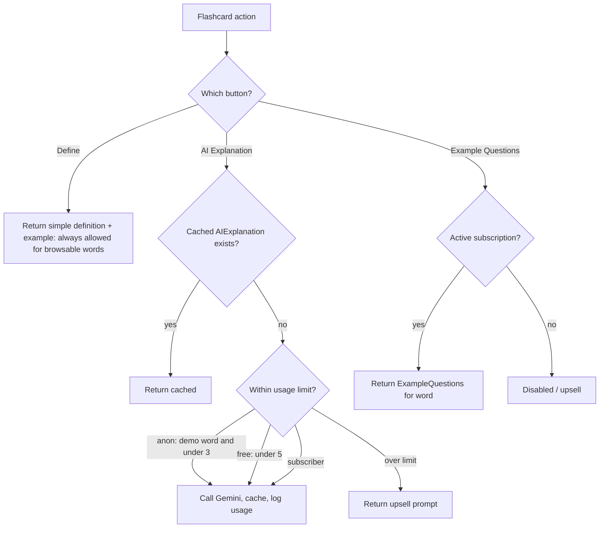
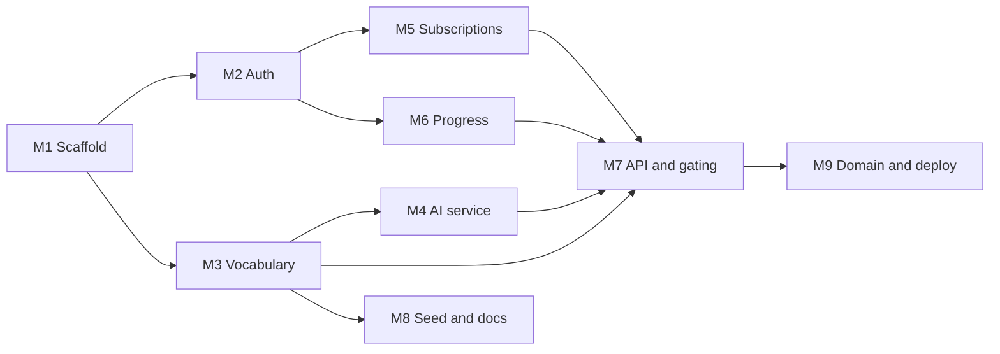
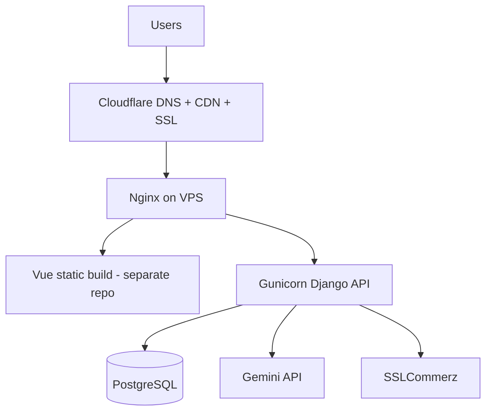

# VocabPluse API — Backend Implementation Plan

**Domain:** [vocabpluse.com](https://vocabpluse.com) (registered on Cloudflare)

**Overview:** Django REST Framework API for vocabpluse.com — flashcard-based English vocabulary learning with Google login, Gemini AI explanations, past-exam questions, progress tracking, and SSLCommerz subscriptions. Content is managed through Django admin. The Vue 3 frontend is a **separate repository** that consumes this API.

---

## Stack

| Layer | Technology |
|-------|------------|
| API | Django 5 + Django REST Framework |
| Database | SQLite (dev) / PostgreSQL (production via `DATABASE_URL`) |
| Auth | Google ID-token verification → JWT (SimpleJWT) |
| AI | Google Gemini (`google-generativeai`), cached per word |
| Payments | SSLCommerz (sandbox-first; mock when no credentials) |
| Content | Django built-in admin |
| Config | `django-environ`, `django-cors-headers` |

## Project structure

```
config/   settings, urls, wsgi/asgi
apps/
  core/         site settings, shared access helpers
  accounts/     custom User, Google auth, JWT endpoints
  vocabulary/   Category, WordSet, Word, AIExplanation, ExampleQuestion
  ai/           Gemini client, AIUsage tracking
  subscriptions/ Plan, Subscription, Payment, SSLCommerz gateway
  progress/     UserProgress
tests/          API integration tests
manage.py
```

---

## Access matrix

| User type | Browse | Define | AI explanation | Example questions | Progress |
|-----------|--------|--------|----------------|-------------------|----------|
| Anonymous | Easy + Medium only | Free | 3 preselected demo words only | Disabled | Not saved |
| Logged-in (free) | Easy + Medium | Free | 5 total | Disabled | Tracked |
| Subscriber | All 4 levels | Free | Unlimited | Enabled | Tracked |

Enforced server-side via `ai.AIUsage`, `core.SiteSetting`, subscription checks, and DRF permission classes.

---

## Data model (Django, managed in admin)

- `accounts.User` (custom, email-based) + `Profile`
- `vocabulary.Category` (GRE / Other), `WordSet` (Category + Level + order; a "chunk of ~30")
- `vocabulary.Word` (text, part_of_speech, simple_definition, example_sentence, `level`, `is_demo`, FK WordSet)
- `vocabulary.AIExplanation` (FK Word, content, generated_at) — cached, regenerable
- `vocabulary.ExampleQuestion` (FK Word, question_text, options/answer, source e.g. GRE/BD-govt, year)
- `subscriptions.Plan` (name, price, duration_days, active), `Subscription` (user, plan, start/end, status), `Payment` (gateway, txn_id, amount, status)
- `progress.UserProgress` (user, word, status new/learning/known, times_seen, last_seen)
- `ai.AIUsage` (user nullable OR session_key, word, created_at) — enforces limits
- `core.SiteSetting` (configurable limits: anon_ai_limit=3, free_ai_limit=5, words_per_set=30)

## Access / gating flow



---

## API (DRF)

- **Auth:** `POST /api/auth/google/`, `/api/auth/refresh/`, `GET /api/auth/user/`
- **Catalog:** `GET /api/categories/`, `GET /api/wordsets/?category=&level=` (level filtered by access), `GET /api/wordsets/{id}/cards/` (shuffled words)
- **Card actions:** `GET /api/words/{id}/define/`, `POST /api/words/{id}/explain/` (Gemini + cache + limit), `GET /api/words/{id}/questions/` (subscription-gated)
- **Progress:** `GET/POST /api/progress/` (JWT, logged-in only)
- **Subscriptions:** `GET /api/plans/`, `POST /api/subscriptions/checkout/`, `POST/GET /api/payments/callback/<outcome>/`
- **Health:** `GET /api/health/`

---

## Domain and deployment (Cloudflare)

- **DNS (Cloudflare):** Point `vocabpluse.com` (and optionally `api.vocabpluse.com`) to hosting; use Cloudflare proxy for CDN + DDoS protection
- **SSL:** Cloudflare Full (strict) once origin has a valid cert (Let's Encrypt or Cloudflare Origin Certificate)
- **Production URLs:**
  - API: `https://vocabpluse.com/api/` (same-origin behind Nginx) or `https://api.vocabpluse.com` — pick one and keep CORS consistent with the frontend origin
- **Django settings:** `ALLOWED_HOSTS`, `CSRF_TRUSTED_ORIGINS`, `CORS_ALLOWED_ORIGINS` for production frontend origin(s)
- **Google OAuth:** Backend verifies Google ID tokens; client id configured via `GOOGLE_OAUTH_CLIENT_ID`
- **Payment callbacks:** SSLCommerz success/fail/cancel URLs must use `https://vocabpluse.com/api/payments/callback/...` (or your chosen API host)
- **Local dev:** `localhost` in `ALLOWED_HOSTS` and `CORS_ALLOWED_ORIGINS`; separate Google OAuth client or additional redirect URIs for local testing

## Required secrets (env)

- `SECRET_KEY`, `ALLOWED_HOSTS`, `SITE_URL`, `CORS_ALLOWED_ORIGINS`
- `DATABASE_URL` (PostgreSQL in production)
- `GOOGLE_OAUTH_CLIENT_ID`
- `GEMINI_API_KEY` (optional; fallback when empty)
- `SSLCOMMERZ_STORE_ID`, `SSLCOMMERZ_STORE_PASSWORD`, `SSLCOMMERZ_SANDBOX`

Seed command + demo words (`is_demo=True`) and one sample plan for first run.

---

## Module-wise implementation breakdown

Ordered by dependency. Frontend (Vue SPA) is out of scope for this repo.

### M1 — Project scaffold & config (`scaffold`)

- `config/` settings, `.env` loading (`django-environ`), DRF, `django-cors-headers`, PostgreSQL support, `apps/` package layout, health endpoint

### M2 — Accounts & auth (`auth`)

- Custom email `User` + `Profile`; Google ID-token verification; JWT via SimpleJWT; `/api/auth/*` endpoints

### M3 — Vocabulary core (`vocab-models`)

- Models: `Category`, `WordSet`, `Word` (`level`, `is_demo`), `AIExplanation`, `ExampleQuestion`
- Django admin with inlines (Words under WordSet, Questions/Explanation under Word) and list filters

### M4 — AI service (`ai-service`)

- `core.SiteSetting` (limits), `ai.AIUsage`
- Gemini client wrapper (model from settings) with offline fallback
- `explain` logic: cache hit → return; else check limit by user/session + demo flag → call Gemini → save `AIExplanation` + `AIUsage`

### M5 — Subscriptions & payments (`subscriptions`)

- `Plan`, `Subscription`, `Payment`
- SSLCommerz sandbox init + callback; mock checkout when credentials missing; activate subscription on verified payment
- Helper for active subscription check

### M6 — Progress (`progress`)

- `UserProgress` (status, times_seen, last_seen)
- `GET/POST /api/progress/` for logged-in users only

### M7 — API & gating layer (`api`)

- Serializers + views for catalog, shuffled cards, define/explain/questions, plans, checkout
- Permission / access helpers encoding the access matrix (level visibility, AI limits, subscription gate)

### M8 — Seed data & docs (`seed-docs`)

- Management command: `python manage.py seed` — categories, sets/words, demo words, sample plan
- README, PLAN.md, `.env.example`

### M9 — Production deployment (`domain-deploy`)

- Gunicorn + Nginx, `collectstatic`, Cloudflare DNS/SSL
- Google OAuth production config, payment callback URLs, PostgreSQL backups

### Module dependency diagram



### Implementation checklist

- [x] M1 — Scaffold Django project (config, DRF, CORS, env settings, apps layout)
- [x] M2 — Accounts: custom email user, Google token auth, JWT
- [x] M3 — Vocabulary: Category, WordSet, Word, AIExplanation, ExampleQuestion + admin
- [x] M4 — AI: Gemini service, caching, AIUsage, configurable limits
- [x] M5 — Subscriptions: Plans, Payment, SSLCommerz + mock flow
- [x] M6 — Progress: UserProgress + endpoints
- [x] M7 — DRF endpoints with gating (catalog, cards, define/explain/questions, checkout)
- [x] M8 — Seed command, README, PLAN.md
- [ ] M9 — Production deploy: Cloudflare, Gunicorn/Nginx, OAuth, payment callbacks

---

## Deployment topology

- **Hetzner Cloud VPS** (or similar): Nginx → Gunicorn (Django API), self-hosted PostgreSQL; optional Redis for caching later
- **Cloudflare** in front for DNS, CDN, SSL, DDoS
- Frontend SPA built separately; Nginx can serve `dist/` and proxy `/api/` to Gunicorn on the same host



### Deployment steps

1. Provision VPS (e.g. Hetzner CPX22); harden SSH, firewall
2. Install Python 3.12+, PostgreSQL; clone this repo; set production `.env`
3. `pip install -r requirements.txt`, `migrate`, `collectstatic`, `createsuperuser`, `seed`
4. Run Gunicorn (`gunicorn config.wsgi:application`); configure Nginx reverse proxy + static
5. Cloudflare: A record → VPS IP (proxied); SSL Full (strict)
6. Update Google OAuth + SSLCommerz callback URLs to production domain
7. Automated `pg_dump` backups and basic uptime monitoring

### Cost estimate (monthly, USD, approx.)

| Item | Cost |
|------|------|
| Hetzner CPX22 VPS (app + DB) | ~$9–10/mo |
| Cloudflare Free plan | $0 |
| Backups / object storage (optional) | ~$1–5/mo |
| Domain (amortized) | ~$1/mo |
| **Infra subtotal** | **~$11–16/mo** |

**Gemini AI:** explanations cached per word; practical monthly cost at small scale **< $1–3/mo** (Gemini 2.5 Flash-Lite).

**Payments:** SSLCommerz ~2–2.5% per transaction; one-time merchant setup fee when going live.

### Scaling path

- Upgrade VPS tier first (vertical scaling)
- Move PostgreSQL to managed hosting if needed
- Add Celery + Redis for async AI/email if volume grows
- Cloudflare cache rules for public catalog responses
